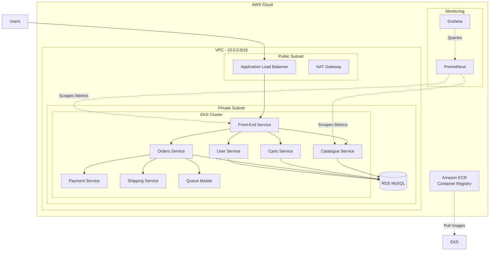

# Architecture Documentation

## System Architecture

## Network Architecture

- **VPC CIDR**: 10.0.0.0/16
- **Public Subnets**: 10.0.1.0/24, 10.0.2.0/24
- **Private Subnets**: 10.0.3.0/24, 10.0.4.0/24
- **Availability Zones**: 2 AZs for high availability

## Components

### Compute
- **EKS Cluster**: Kubernetes 1.29
- **Node Groups**: 2 t3.medium instances
- **Auto Scaling**: Enabled

### Storage
- **RDS MySQL**: db.t3.micro (Multi-AZ)
- **EBS Volumes**: gp3, 20GB per node

### Networking
- **Load Balancer**: Application Load Balancer
- **Security Groups**: Configured for least privilege
- **VPC Peering**: Not configured

### Container Registry
- **ECR Repositories**: 12 repositories (one per microservice)
- **Image Scanning**: Enabled on push
