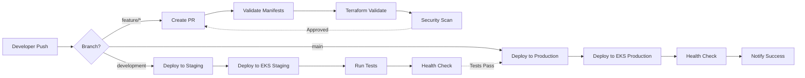

# CI/CD Pipeline Documentation

## Pipeline Overview

## Pipeline Stages

### 1. Code Validation
- Kubernetes manifest validation
- Terraform format and validation
- Security scanning

### 2. Build & Test
- Validate infrastructure code
- Check deployment files
- Run dry-run deployments

### 3. Deploy to Staging
- Triggered on `development` branch
- Deploys to `sock-shop-staging` namespace
- Runs integration tests

### 4. Deploy to Production
- Triggered on `main` branch
- Deploys to `sock-shop` namespace
- Zero-downtime rolling updates
- Health checks and monitoring

## Branching Strategy

- `main` - Production environment
- `development` - Staging environment
- `feature/*` - Feature development
- `hotfix/*` - Emergency fixes

## Required Secrets

Configure in GitHub Settings → Secrets:
- `AWS_ACCESS_KEY_ID`
- `AWS_SECRET_ACCESS_KEY`
